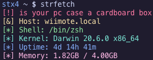

# strfetch
A minimal, fun fetch in plain C.

## Basics

strfetch prints a silly message along with your fetch, which can be default or custom.

"str" in strfetch stands for "string" - so of course we need a string

Version 1.2 has added a configuration file, which allows you to pick colors and where to place your fetch items.

No. Windows is not supported.

## Usage
`strfetch <string>`

strfetch will display your string as an alert in the fetch on the first line. If there is none parsed, a random default based on your computer's time as a seed will be shown.

Strings do not require quotes but using them if implementing strfetch into your shell, for example, is good practice. 

## Installation

There are 2 methods for installation - compiling manually, or grabbing the latest build from Actions.

It is recommended to grab from Actions if you don't feel like compiling, but compiling is the better option sometimes.

Head over to [Actions](https://github.com/stx3plus1/strfetch/actions/workflows/c-cpp.yml) and grab the lastest artifact...

then find the file, and run `chmod +x <drag the file into your terminal>` to mark it as executable.

Then, `./strfetch` will execute it in place, and you can install it properly by copying it to /usr/local/bin (`sudo cp strfetch /usr/local/bin`)

Copy the configuration file to ~/.config/strfetch/conf, if you want to configure. The no config message is gone now, and will autogenerate if possible.

Makefile does this automatically, so compilation is suggested.

This is only suggested when you don't have a compiler, nor do you want one taking up storage. Compiling makes it a lot easier to install.
 
## Compile
Compilation for macOS, Linux and GNU/Hurd. 

Remember to set CC to your compiler if you aren't using gcc, or clang aliased to "gcc" (Apple...)

Make sure a good C compiler (gcc, clang, etc..) and sufficient headers are installed, then:

`make && sudo make install && make install-config`

to compile then add strfetch to /usr/local/bin. If your shell doesn't have it in PATH, add it!

## Configuration

The config file is placed locally to each user.

It is located at `~/.config/strfetch/conf`, where ~ is the home directory.

### The file works like this:

Comments are defined with `//`. 

The first line contains "color-true" or "color-false" to define color switch. "color-false" will ignore all color calls.

The ASCII logo type is defined by "ascii-tux" or "ascii-apple".

More ASCII logos will be added, but you can also pull request some in yourself if you want!

Colors are defined before the fetch option. Colors have to be repeated for each item.

Valid colors are: white, black, dr (dark red), red, yellow, green, cyan, blue, purple.

The fetch items are defined after color options or on a separate line.

Valid fetch items are: string, distro, hostname, kernel, cores, uptime, memory.

Read the default config file for more information on syntax. 