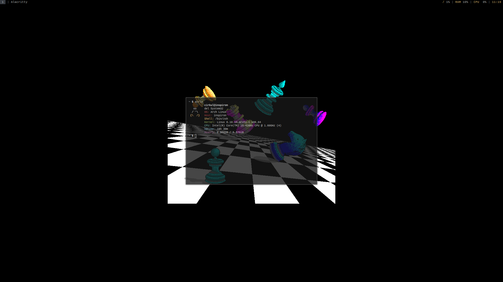

# strlx
A quick "getting started" guide, rewritten partially for 2.0.

## Basics

strlx prints a message along with your system information, which can be default or custom.

"str" in strlx stands for "string" - the main point of the program.

## Usage
`strlx <string>`

strlx will display your string in the information. If there is none parsed, a random (sometimes a bit odd) default will show.

Strings do not require quotes but using them if implementing into your shell, for example, is good practice. 

## Installation

There are 2 methods for installation - compiling manually, or grabbing the latest release from [Releases](https://github.com/stx3plus1/strlx/releases/).

Run `chmod +x <the executable>` to mark it as executable, if you cannot run it (ex  [shell] - Killed).

You can install it properly by copying it to /usr/local/bin (`sudo cp strlx /usr/local/bin`)

strlx will automatically write a configuration file on first run and you can modify this config later.
 
## Compile
Compilation works on Linux, GNU and OS X.

Remember to set CC to your compiler if you aren't using gcc and your compiler does not provide it. 

`sudo make install`

to compile then add to /usr/local/bin. Add /usr/local/bin to PATH to ensure strlx can bn found after.

## Configuration

strlx looks in `~/.config/strlx/conf`, where ~ is the home directory.

### The file works like this:

The ASCII logo is set with "ascii-tux" or "ascii-apple".

The "reset" keyword only prints an ANSI reset (which clears any formatting) and is simply "\x1b[0m" in a printf. You can use this  yourself.

Colors are defined before the option. Colors HAVE TO BE REPEATED for each item.

Valid colors are: white, black, dr (dark red, in some shells a bit lighter), red, yellow, green, cyan, blue, purple.

Valid items are: string, distro, hostname, shell, kernel, cpu, uptime, memory.

If you have any trouble, delete the configuration file and let strlx recreate it.
