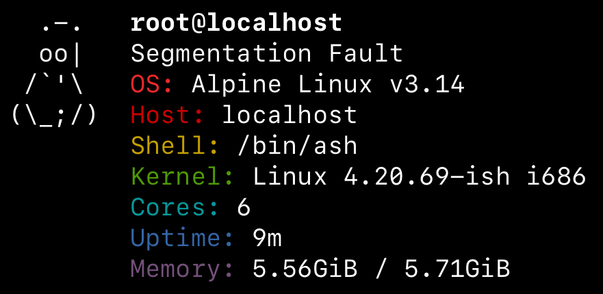

# strlx
A minimal, fun and **fast** fetch programmed in raw C.

## Basics

strlx prints a really silly message along with your fetch, which can be default or custom.

"str" in strlx stands for "string" - so of course we need a string...

No. Windows is not supported.

## Usage
`strlx <string>`

strlx will display your string as an alert in the fetch on the first line. If there is none parsed, a random default based on your computer's time as a seed will be shown.

Strings do not require quotes but using them if implementing strfetch into your shell, for example, is good practice. 

## Installation

There are 2 methods for installation - compiling manually, or grabbing the latest build from Actions.

It is recommended to grab from Actions if you don't feel like compiling, but compiling is the better option.

Head over to [Actions](https://github.com/stx3plus1/strfetch/actions/workflows/c-cpp.yml) and grab the lastest artifact.

Run `chmod +x <the executable>` to mark it as executable.

You can install it properly by copying it to /usr/local/bin (`sudo cp strlx /usr/local/bin`)

Copy the configuration file to ~/.config/strlx/conf, if you want to configure.

Makefile does this automatically, so compilation is suggested.
 
## Compile
Compilation for Linux, OS X and GNU (Hurd).

Remember to set CC to your compiler if you aren't using gcc, or clang aliased to "gcc" (Apple...)

`make && sudo make install && make install-config`

to compile then add to /usr/local/bin. Add /usr/local/bin to PATH to ensure strlx functions after.

## Configuration

strlx looks in `~/.config/strfetch/conf`, where ~ is the home directory.

### The file works like this:

The first line contains "color-true" or "color-false" to define color switch. "color-false" will ignore all color calls (I think...)

The ASCII logo is set with "ascii-tux" or "ascii-apple".

Correctly programmed pull requests or simply just logos will be accepted, provided someone adds the code part before merging.

The "reset" keyword only prints an ANSI reset (which clears any formatting) and is simply "\x1b[0m" in a printf. You can use this on the shell if your shell breaks.

Colors are defined before the fetch option. Colors HAVE TO BE REPEATED for each item.

Valid colors are: white, black, dr (dark red), red, yellow, green, cyan, blue, purple.

Valid fetch items are: string, distro, hostname, kernel, cpu, uptime, memory.

Read the default config file if I didn't explain well enough... I shouldn't have tried to explain
